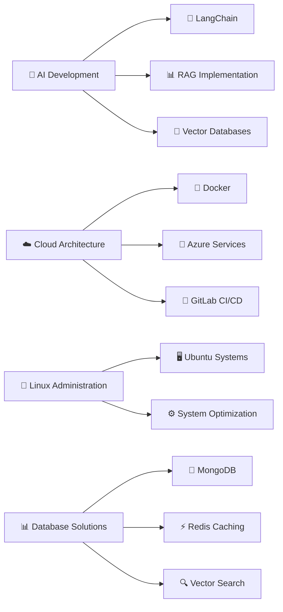

  

<h1 align="center">
  
</h1>

  <em>Passionate Full Stack Developer | AI & Cloud Solutions Architect | DevOps Enthusiast</em>

---

## 💫 About Me:

🚀 **Full Stack Developer** with expertise in modern web technologies and cloud infrastructure  
🤖 **AI Enthusiast** specializing in Generative AI, LangChain, and RAG implementations  
☁️ **Cloud Solutions Architect** experienced with Azure, Docker, and containerization  
🐧 **Linux System Administrator** proficient in Ubuntu and system optimization  
📊 **Database Expert** working with MongoDB, Redis, and vector databases  

- 🔭 I'm currently working on **AI-powered applications with RAG implementation**
- 🌱 I'm learning **Advanced cloud architectures and DevOps practices**
- 👯 I'm looking to collaborate on **Open source projects and AI solutions**
- 💬 Ask me about **React, AI, Cloud Computing, and DevOps**
- ⚡ Fun fact: **I love exploring new technologies and building scalable solutions**

---

## 🌐 Connect with Me:

  
  
  

---

## 💻 Tech Stack:

### 🚀 Programming Languages
 
 
 

### 🎨 Frontend Development
 
 
 
 

### 🗄️ Databases & Storage
 

### ☁️ Cloud & DevOps
 
 
 

### 🤖 AI & Machine Learning

### 🛠️ Tools & Version Control
 
 

---

## 🎯 Areas of Expertise:

<table>
<tr>
<td width="50%">

### 🌐 Web Development
- **Frontend**: React, Redux, Modern CSS
- **Backend**: REST APIs, Microservices
- **Full Stack**: End-to-end development

### ☁️ Cloud & DevOps  
- **Azure Cloud Services**: Compute, Storage, AI
- **Containerization**: Docker, Orchestration
- **CI/CD**: GitLab CI/CD, Automation

</td>
<td width="50%">

### 🤖 Artificial Intelligence
- **Generative AI**: LLM Integration
- **LangChain**: Agent Development
- **RAG**: Vector Database Implementation

### 🗄️ Database Management
- **NoSQL**: MongoDB, Document Stores
- **Caching**: Redis, In-memory Storage
- **Vector DB**: Similarity Search, AI Apps

</td>
</tr>
</table>

---

## 📈 Current Focus:

---

## 📊 GitHub Stats:

 
 

  

  

  

---

## 🏆 GitHub Trophies:

  

---

## 📝 Latest Projects & Contributions:

- 🔥 **AI-Powered Applications**: Building intelligent systems with LangChain and RAG
- 🌐 **Full Stack Development**: Creating modern web applications with React and cloud backend
- ☁️ **Cloud Solutions**: Architecting scalable applications on Azure with Docker containerization
- 🤖 **Generative AI Integration**: Implementing cutting-edge AI solutions for real-world problems

---

  

  <em>💡 "Building the future, one line of code at a time" 💡</em>

---

<!-- Proudly created with passion for technology and innovation -->